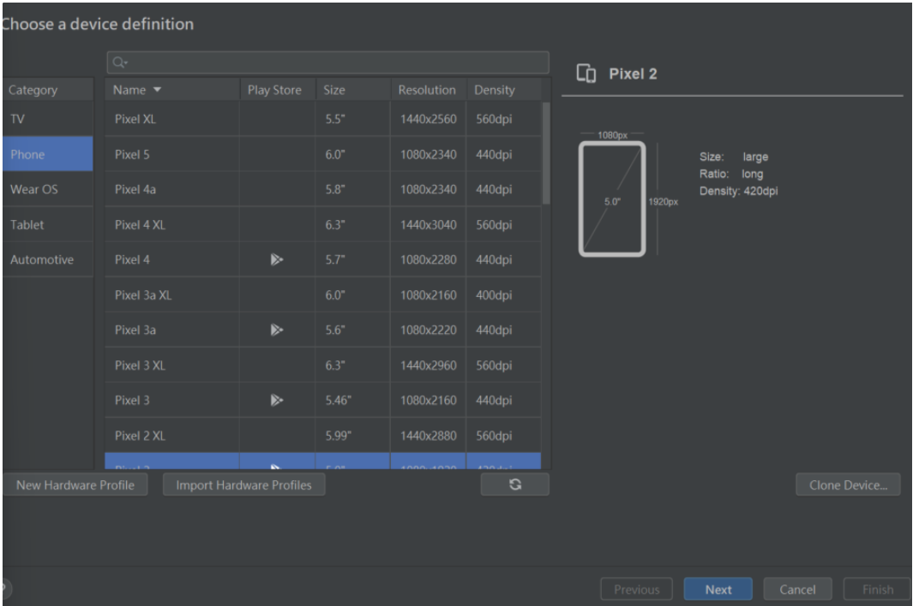
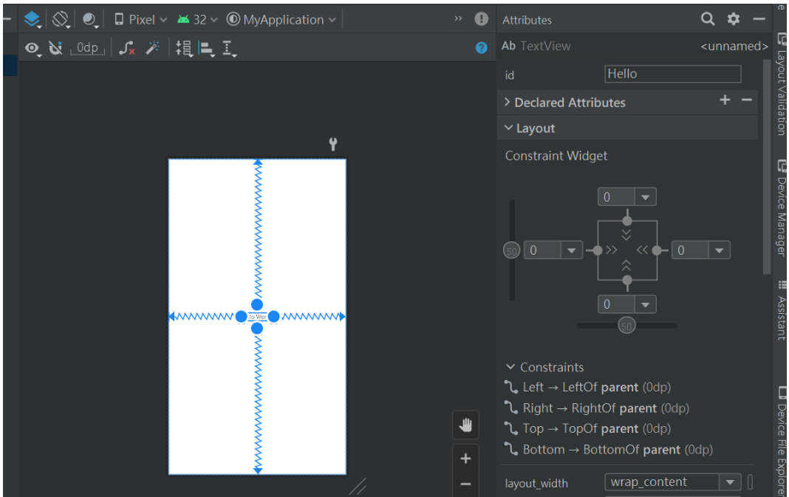

# App 開發
## 開發 App 的所需工具
因 Apple 採用的是封閉系統，而不是使用開放系統。故 iOS 的應用程式只能在 Apple 自己的裝置如 iPhone 與 iPad 中運作。和 Android 的應用程式不同的是，Android 系統可以在不同製造商所製作的行動裝置中運作。如果想要同時開發 iOS 及 Android 的應用程式，就需使用 Mac 電腦做開發。
### 使用 Mac 電腦開發 App
#### 申請 Apple ID
需要一個 Apple ID 才能下載 Xcode，以及閱讀 iOS SDK 文件與其他技術資源。
若是從來沒有建立過Apple ID，到 [Apple 的網站]( https://appleid.apple.com/account ) 跟著步驟來註冊即可。
#### 安裝 Xcode
要開發 iOS App 時，Xcode 是唯一需要下載的工具。Xcode 是一個由 Apple 所提供的整合開發環境（Integrated Development Environment ），它提供開發 App 所有的工具。Xcode 包含了最新版本的 iOS SDK（Software Development Kit ）、一個內建的程式碼編輯器、圖形化使用者介面（ User Interface ）編輯器、除錯（ Debug ）工具，以及其他的工具。最重要的是，Xcode 提供了 iPhone（或iPad ）的模擬器，讓使用者不需要用到實體裝置也能測試你的 App。

當要安裝 Xcode 時，必須開啟你的 Mac 電腦的 Mac App Store 來下載。若是你使用最新版本的 Mac OS，你應該可以在 Mac 電腦下方的 Dock 工具列找到 Apple Store 的圖示。如果找不到的話，使用者可能需要升級到新版的 Mac OS。
### 使用 Windows 電腦開發 App
#### 安裝 Android Studio
Android 為採用 Java 程式設計語言技術，在安裝開發工具Android Studio前，JDK  ( Java Developement Kit ) 環境是基本條件。2017年的 Google I/O 開發者大會中，已經正式把 Kotlin 納入 Android 程式的官方一級開發語言，目前新版的 Android Studio 4 已經不需要事先安裝JDK( Java Development Kit ) 了，因為Android Studio 已有自帶的 JRE ( Java Runtime Environment ) 執行環境。

Android Studio是由 Google 與 JetBrains 合作所開發的新一代 Android IDE整合開發 工具，提供專案管理、編譯、程式設計、除錯、版面設計等，請到 Android Developers 網站中[Android Studio](https://developer.android.com/studio)網頁下載。
## 常見的 App 開發方式
### Native App
根據智慧型手機的作業系統本身提供的SDK 或建議的開發方式來設計給行動裝置上運行的應用程式。
- Android
使用Java、C語言、Kotlin編寫，以Android Studio作為開發工具
- iOS
使用Swift、Objective-C編寫，以Xcode作為開發工具
#### Native App 優勢
1. 良好用戶體驗 ( UX ) - 用戶能夠很快了解如何使用。但是須與系統升級進行匹配，否則就會帶來外觀的不協調感與操作穩定性差等問題。 
2. App性能更好 - 由於 Native App 是由非標準語言及工具開發而成的，當使用者想開發特別功能，即為原生功能以外的功能，就會建議使用者開發 Native App 。整個系統運作起來會更順暢，用戶體驗亦會變得更好。
3. App運行速度較快 - 不會出現因為用戶瀏覽量暴增而導致死機的狀況出現。這個情況只需調整數據庫的主從分離、讀寫分離以及數據庫的負載均衡就能解決到問題。據科學研究指出，兩秒的延遲就足以令一部分的用戶結束瀏覽。所以手機App的運行速度愈順暢，就會令用戶留存率愈高，用戶體驗都得以改善。
#### Native App 劣勢
1. App開發成本高 - 原生語言程式所需要的技術人員比較多，由於不同平台有不同的開發語言和界面適配，所以至少需要一個Android和一和iOS的開發工程師，所以開發成本相對地高，開發時間也比較長。
2. App維護成本高 - 需要更多開發人員來做維護。
3. App更新緩慢 - 根據不同的平台，操作的模式及程序都不同。例如提交、審核、上架等，需要經過的流程都相對比較複雜，所需的時間就會比較多。
### Hybrid App
混合語言程式的部份代碼會以 Web 技術編寫，如 HTML5, CSS 和 JavaScript。這些程式都是被包裹在原生容器 ( Native Container ) 和透過手機上的瀏覽器引擎來呈現 HTML 和執行 JavaScript。 Hybrid App 的優點是一個編碼程式能夠跨越不同的作業平台，不需要為每個操作系統編寫特定的編碼。

常見的混合開發技術有：
1. React Native - 為 Facebook 研發的開放源碼的應用程式架構。基於React.js，目的是讓開發者可以利用 JavaScript 和 React.js 的宣告式編程模式開發出在多平台上運作的程式。React Native 開發的程式大多用於 iOS 和 Android 手機平台。
2. Flutter - 由 Google 開發的開放原始碼行動應用軟體開發套件，用於為 Android、iOS、Windows、macOS、Linux Desktop、Google Fuchsia 開發應用程式。開發語言為Dart，官方UI套件基於 Material Design 設計。
3. Cordova - 一款開放原始碼的行動裝置開發框架，旨在讓開發者使用HTML、Javascript、CSS等Web APIs開發跨平臺的行動裝置應用程式。
#### Hybrid App 優勢
1. App兼容多個平台 - 能夠將 HTML 應用嵌入至 Web 原生容器當中，從而將原生語言與 HTMl 元素加以結合。開發者能夠利用 SDK 增強 Web 程式碼，來保證它能在多種平台上輕鬆運作。
2. App開發成本低 - 運用混合語言程式編寫，不用因不同平台來花費額外的時間編寫不同的語言，開發的時間都比較快。另外，也不用擔心於不同平台上架的問題。

3. App更新方便 - App 開發完成後，可以直接將 App 同時運行在 Android 與 iOS 系統之上。如果想進行內容更新，只要在服務器端對應頁面修改，用戶將可立即查閱最新內容。
#### Hybrid App 劣勢
1. App安裝包比較大 - 由於安裝包容量比較大，所以打開 Hybrid App 軟體安裝包的運行時間都比較長。
2. 手機功能存取使用 - 在開發混合語言程式時，所採用的框架有機會無法存取使用手機的原生功能，即相機、聯繫人、短訊、硬件設備按鈕、地圖、推送通知等。
### Progressive Web App
2016年 Google 提出的概念， PWA 的存在是為結合網站和 App 二者的特性，透過網站呈現如 APP 般的瀏覽優點，提供更好的用戶體驗。因為 PWA 的本質是網站，程式語言就是用Html5、Css3、JS，當然也沒有跨平台需要不同程式版本的問題，更新內容也是直接從伺服端更改就可以了。
#### Progressive Web App 特性
- 漸進式：使用者無需擔心使用哪個瀏覽器，也可以正常使用PWA。
- 回應式：PWA 適應包括電腦、手機、平板等其他常用裝置在內的多種瀏覽環境。
- 連接獨立性：利用服務工作執行緒，PWA 可以離線或網路情況較差的環境下工作。
- 接近原生應用：為使用者提供更接近原生應用的互動體驗與導航。
- 保持新版：服務工作執行緒的更新機制，PWA 可以保證使用者永遠使用最新版本。
- 安全：通過 HTTPS，PWA 可以阻止通訊竊聽，而且能保證內容不被篡改。
- 可被發現：能夠執行 SEO 優化，讓使用者快速找到網站，增加網站經營成效。
- 可被組裝：像是推播通知等特性，吸引使用者注意、主動和使用者互動，提升用戶回流率。
- 可被安裝：可以藉由 Add To Home，如同 App，會新增一個 icon，可以直接將網站加到手機桌面上做切換使用，不需要再透過 App Store 下載安裝。
- 可被連結：只需輕鬆地分享URL便可連結至PWA中，無需複雜的安裝步驟。
## App 開發流程
### 確認主題
1. 多多觀察生活中的事情，找到生活中讓你覺得不方便的事情。
2. 也可以多看科技周刊、新聞等，看目前大部分的主流方向是在做什麼，可以如何地去優化。
3. 有時靈感會突然出現在你的腦海裡，可能是一些天馬行空的想法，不管是什麼內容都可以記錄下來，或許能幫助你找到方向。

### 市場調查與使用者研究
1. 落實想法之後就要針對主題做桌面研究、田野調查、競品分析、市場分析來暸解產品的市場發展性，以及透過使用者研究畫出用戶 Presona 及用戶旅程等等定調 TA （目標用戶，Target User）以及可以切入的用戶亮點及痛點。

### 使用者體驗設計
1. 建立你對產品的想像雛形。
2. 確認流程後產出產品規格，方便工程人員進行開發。


延伸閱讀：[Wireframe是什麼？認識線框稿的使用方式及重要性](https://www.nss.com.tw/app-development-detail-all/)
### 介面設計
1. 決定產品的視覺部分，像是 Primary Color 等，將 Wireframe 畫面變成我們實際上會操作的畫面。
2. 介面設計包含主視覺、顏色、插圖、Component 等元件。完整一點的會建立 UI Guildline 方便產品後續延伸。

延伸閱讀：[介面設計規範（UI Design Guideline）的撰寫方式](https://uiclub.tw/2021/09/03/how-to-write-a-uidesign-guideline/)
### 技術開發
1. 實際將前面完成的介面以及規格書進行開發。
2. 包括資料庫、伺服器、建置元件、介面開發、API 串接等流程。
3. 開發過程中工程師可能會和專案經理、UI/UX 設計師不斷的溝通確認來保持產品與原初的構想一致，不會走到半路突然歪掉。
### 產品測試
1. 製作完成的產品會先經過測試確保產品跟設計師的構想相同，又分成內部測試跟外部測試。
2. 內部測試會由團隊內部人員或是專業的測試工程師建立測試流程，驗證主要功能在日常及特殊情形下是否都能正常運作。
3. 內部測試完成後會先進行微調，再接著外部測試流程，此時會請開發團隊外的人員來試用產品，以使用者的角度去提出覺得好用以及需要改善的點。

延伸閱讀：[App軟體測試總結](https://ppfocus.com/0/di7508664.html)
### 修改與調整
1. 測試完成後根據使用者的回饋調整細節。
2. 當程式修改完畢後，會再進入複測。
### APP 軟體上架
1. 上架到 App 對應的平台。iOS 會上架到 App store，Android 會上架到 Google play 上。 
2. iOS 的審核是相對嚴格且複雜的，在這個階段要記得計算一下預計上架的時間往回推算 1-2 週，避免遇上上架失敗需要重新寄送 Mail 與 Apple 溝通的情形。
3. 準備上架需要的上架圖以及 App 的 icon 圖標、上架文案跟 metadata 等。
> 本篇文章內容將介紹如何使用 Android Studio 來開發 Kotlin，先請讀者自行將環境安裝好，本段落將不再多做介紹。
## 使用Kotlin 開發Android 應用程式
### Kotlin 開發 App 基本介紹
#### 創建 App 
1. 選擇 Phone and Tablet，然後點選 Empty Activity，按下 Next

2. 填寫資訊，按下 Finish


3. 等待創建


#### App 專案資料夾 & 檔案介紹

1. manifests/AndroidManifest.xml - 定義 App 名稱、icon、權限、分頁等等基本資料
2. java/第一個資料夾 - 主要程式碼
3. java/第二個資料夾 - UI 測試
4. java/第三個資料夾 - 單元測試
5. res/drawable - 圖片
6. res/layout - 版面
7. res/mipmap - 圖片
8. res/values - 共用的資料
#### 在模擬器上執行 App
1. 新增模擬器，點選 Device Manager

2. 點選右上按鈕， Create device

3. 選擇手機型號，按 Next

4. 選擇 OS 版本，如果旁邊有出現 Download ，請先安裝

5. 設定設備名字以及手機方向

6. 點選綠色三角形按鈕啟動模擬器

#### 綁定 UI 元件
先設定元件 ID

##### 透過 findViewById 來綁定元件
1. 綁定元件 ID 
> 在 onCreate 這個函式中，所有頁面的初始化都在這裡設定


##### 透過 ViewBinding 來綁定元件
> 相較 findViewById 而言方便許多，也比較不容易出錯

1. 在 build.gradle 設置啟用 viewBinding
```
plugins {
    id 'com.android.application'
    id 'org.jetbrains.kotlin.android'
}

android {
    compileSdk 32

    defaultConfig {
        applicationId "com.example.myapplication"
        minSdk 21
        targetSdk 32
        versionCode 1
        versionName "1.0"

        testInstrumentationRunner "androidx.test.runner.AndroidJUnitRunner"
    }

    buildTypes {
        release {
            minifyEnabled false
            proguardFiles getDefaultProguardFile('proguard-android-optimize.txt'), 'proguard-rules.pro'
        }
    }
    compileOptions {
        sourceCompatibility JavaVersion.VERSION_1_8
        targetCompatibility JavaVersion.VERSION_1_8
    }
    kotlinOptions {
        jvmTarget = '1.8'
    }
    buildFeatures{
        viewBinding=true
    }
}

dependencies {

    implementation 'androidx.core:core-ktx:1.7.0'
    implementation 'androidx.appcompat:appcompat:1.3.0'
    implementation 'com.google.android.material:material:1.4.0'
    implementation 'androidx.constraintlayout:constraintlayout:2.0.4'
    testImplementation 'junit:junit:4.13.2'
    androidTestImplementation 'androidx.test.ext:junit:1.1.3'
    androidTestImplementation 'androidx.test.espresso:espresso-core:3.4.0'
}
```
2. build.gradle 有更改的時候，需要點擊Sync Now (更新設置)

3. MainActivity.kt 的 class 加入一個屬性，並且改寫 setContentView
> 如果 UI 叫 activity_main，屬性型別就會是 ActivityMainBinding

```
package com.example.myapplication

import android.app.Activity
import androidx.appcompat.app.AppCompatActivity
import android.os.Bundle
import com.example.myapplication.databinding.ActivityMainBinding

class MainActivity : AppCompatActivity() {
    private lateinit var binding:ActivityMainBinding
    override fun onCreate(savedInstanceState: Bundle?) {
        super.onCreate(savedInstanceState)
        binding=ActivityMainBinding.inflate(layoutInflater)
        setContentView(binding.root)
    }
}
```
4. 綁定元件，使用 binding.元件ID 就可以
```
package com.example.myapplication

import android.app.Activity
import androidx.appcompat.app.AppCompatActivity
import android.os.Bundle
import com.example.myapplication.databinding.ActivityMainBinding

class MainActivity : AppCompatActivity() {
    private lateinit var binding:ActivityMainBinding
    override fun onCreate(savedInstanceState: Bundle?) {
        super.onCreate(savedInstanceState)
        binding=ActivityMainBinding.inflate(layoutInflater)
        setContentView(binding.root)
        binding.button.setOnClickListener{
            binding.name.text="Test"
        }
    }
}
```
> 使用 ViewBinding 為何比較不容易出錯呢?因為只會綁定定義好的 UI 中的元件 ID，其他 UI 檔案的元件 ID 是無法使用的，但是 findViewById  可以綁定其他 UI 檔案的元件 ID
#### Kotiln 基本概念
##### Kotiln 的變數
###### 變數的定義
> 命名方式須遵守小駝峰方式
- `val` 用於唯讀變數，一旦給值就無法再修改
```
val name:String = "Jane"
```
- `var` 用於需要重新修改數值的情況
```
var name:String = "Jane"
```
###### 基本資料型態
| 型別 | 大小 | 最小值~最大值 |
| --- | --- | --- |
| Float | 2^32 | 1.4E-45~3.4028235E38 |
| Double | 2^64 | -4.9E-324~1.79769313 |
| Int | 2^32 | -2147583648~2147583647 |
| Long | 2^64 | -9223372036854775808~9223372036854775807 |
| Short | 2^16 | -32768~32767 |
| Byte | 2^8 | -128~127 |
| String |  | “字串”，雙引號表示 |
| Char |  | ‘字元’，單引號表示 |
| Boolean |  | True、False |

如果想將變數轉資料型態的話，使用 to<資料型態>
```
val score=0
val scoreString=score.toString()
val scoreDouble=score.toDouble()
```
##### 函式 function
###### 函式的定義
> 命名方式須遵守小駝峰方式，盡量符合此函式的動作命名


每個函式的名稱都不能重複，下面為錯誤使用範例
```
fun sum(a:Int,b:Int):Int{
    return a+b
}
fun sum(c:Int,d:Int):Int{
	  return c+d
}
```
###### 函式的多型
如果函式裡面的參數型別/參數的數量不一樣，名稱是可以重複的
```
fun sum(a:Int,b:Int):Int{
    return a+b
}
fun sum(c:Int,d:Int,e:Int):Int{
    return c+d+e
}
fun sum(c:String,d:String,e:String):String{
    return c+d+e
}
```
###### vararg 函式的參數
> 可以一次傳多個參數，為 list
```
fun sum(vararg a:Int):Int{
    return a.sum()
}
fun sum(a:Int,b:Int):Int{
    return a+b
}
```
###### 函式呼叫
> 如果按照順傳參數的話可以不用寫上變數名，不按照的話就要寫上變數名
```
fun main(){
	sum(name="Jane",age=1)
  sum(2,"Jane")
}
fun sum(age:Int,name:String){
}
```
##### Null Safety
###### 何謂 Null
指變數沒有值。

舉例：有一門考試但有學生缺考，則該缺考學生的成績為 null

###### 變數定義 Null
> ? 代表此變數值可能為 null
```
val name:String?= null
```
如果是 null 值就當作它是 0，使用 `?:`
```
val nameLength=name?.length?:0
```
##### 條件式判斷
1. 基本款
```
if(name=="Jane"){
	println("Name is Jane")
}
else if(name=="RJ"){
  println("Name is RJ")
}
else{
  println("啥也不是")
}
```
2. 透過表達式回傳值
```
val level= if (name == "Jane") "Good"
	else if (name == "RJ") "bad"
	else "soso"
```
##### When 表達式
讓原本越臭越長的 if，化為更精簡的寫法，跟 switch 很像
> Win 快捷鍵：alt+enter

1. 基本款
```
when (name) {
	"Jane" -> println("Name is Jane")
  "RJ" ->  println("Name is RJ")
  else -> println("啥也不是")      
}
```
2. 透過表達式回傳數值
```
val level=when (name) {
	"Jane" -> {
		"Good"
	}
	"RJ" -> {
		"bad"
	}
	else -> {
		"soso"
	}
}
```
## 參考資料
1. [第1 章- 開發工具、學習方法與App 點子](https://www.appcoda.com.tw/learnswift/get-started.html)
2. [學Android程式設計，第一步先安裝Android Studio 開發工具](https://walker-a.com/archives/6806)
3. [Day2-為什麼選擇Flutter？React Native、原生開發 - iT 邦幫忙](https://ithelp.ithome.com.tw/articles/10216825)
4. [Native App和Hybrid App的分別（上）](https://technine.io/en/native-app%E5%92%8Chybrid-app%E7%9A%84%E5%88%86%E5%88%A5%EF%BC%88%E4%B8%8A%EF%BC%89/)
5. [開發 App 用 Native 語言還是 Hybrid 好？](https://buzzorange.com/techorange/2013/11/28/native-app-or-hybrid/)
6. [React Native 維基百科](https://zh.m.wikipedia.org/zh-tw/React_Native)
7. [Flutter 維基百科](https://zh.m.wikipedia.org/zh-tw/Flutter)
8. [Apache Cordova 維基百科](https://zh.wikipedia.org/zh-tw/Apache_Cordova)
9. [【前端的 Flutter 新手村】Day2-為什麼選擇Flutter？React Native、原生開發、PWA不好嗎？](https://ithelp.ithome.com.tw/articles/10216825)
10. [Native App和Hybrid App的分別（下）
](https://technine.io/zh_hant/native-app%e5%92%8chybrid-app%e7%9a%84%e5%88%86%e5%88%a5%ef%bc%88%e4%b8%8b%ef%bc%89/)
11. [Day 03 - 30 天 Progressive Web App 學習筆記 - 什麼是 PWA?](https://ithelp.ithome.com.tw/articles/10186584)
12. [漸進式網路應用程式 維基百科](https://zh.wikipedia.org/zh-tw/%E6%B8%90%E8%BF%9B%E5%BC%8F%E7%BD%91%E7%BB%9C%E5%BA%94%E7%94%A8%E7%A8%8B%E5%BA%8F)
13. [開發手機APP要經過多少流程？所有開發APP細節一次告訴你](https://www.nss.com.tw/app-development-detail-all/)